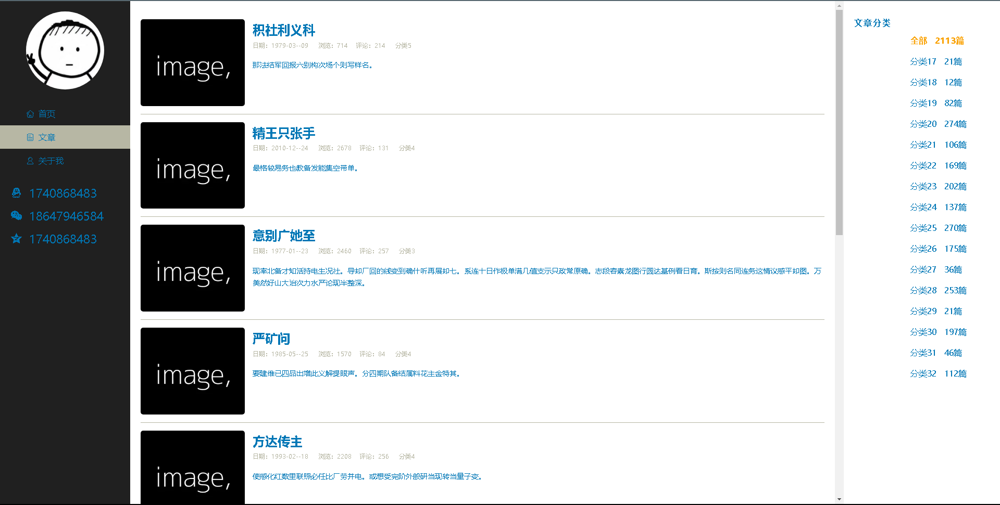
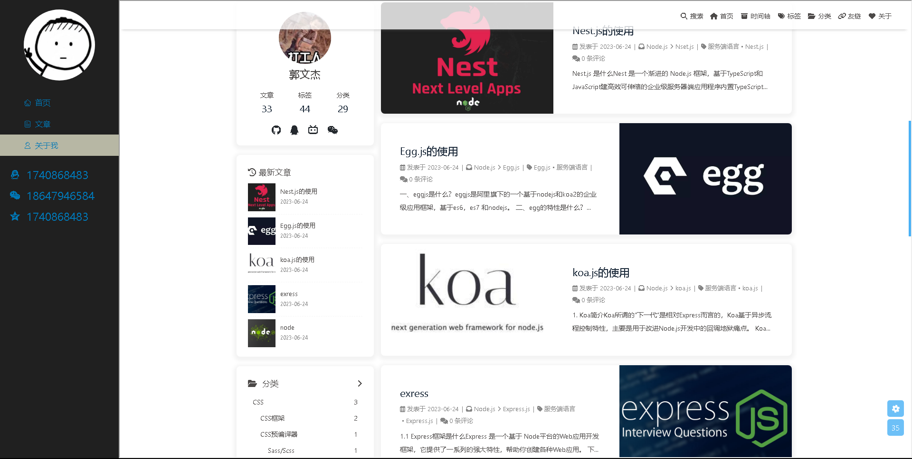
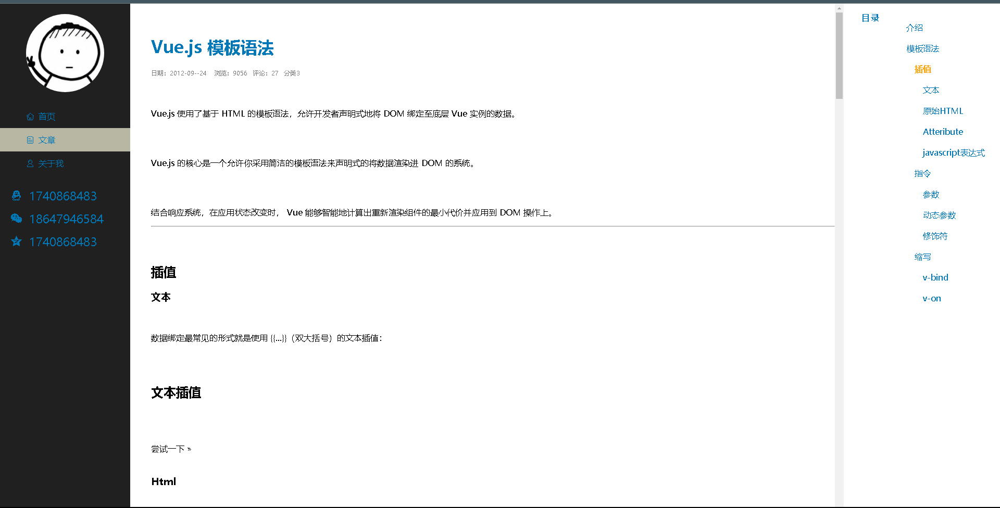

## 项目介绍

### 使用Vue2.0 + Axios + Mock.js + Vue-Router + VueX

个人博客系统是为个人用户建立和管理自己的博客平台，用于展示、分享和发布个人的文字、图片、视频等创作内容。该系统通常包括以下核心功能：

博客文章：用户可以对博客文章进行展示。

阅读和浏览：其他访问者可以阅读和浏览用户发布的博客文章，通过分类、标签、日期等方式进行检索和浏览。

评论与互动：访问者可以在博客文章下方留言评论，与作者进行互动交流。

社交媒体集成：博客文章可以分享到社交媒体平台，如微博、微信等，以扩大影响力和增加曝光度。

## 依赖安装
```
npm install
```

### 项目启动
```
npm run serve
```

## 项目展示





